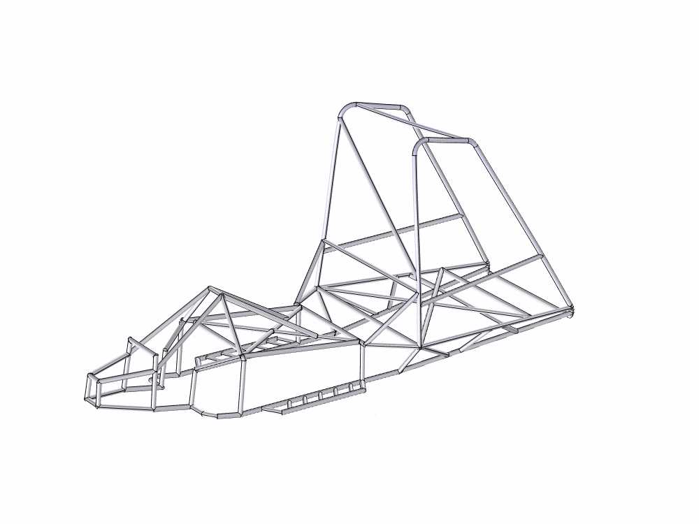
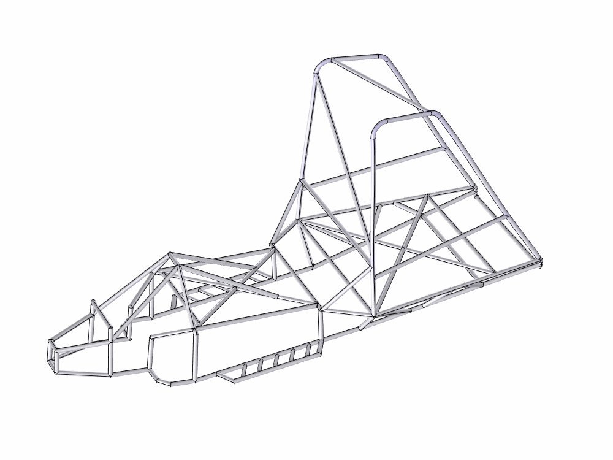
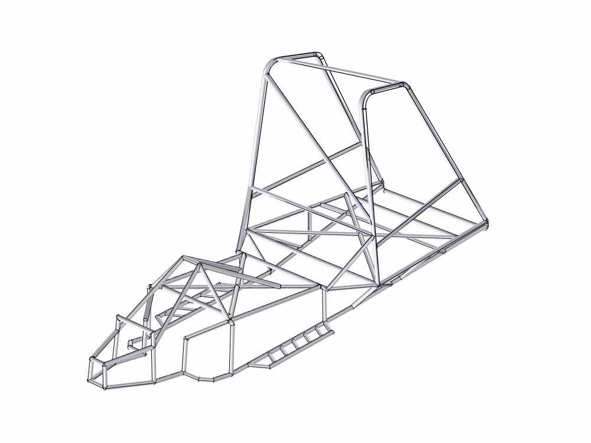
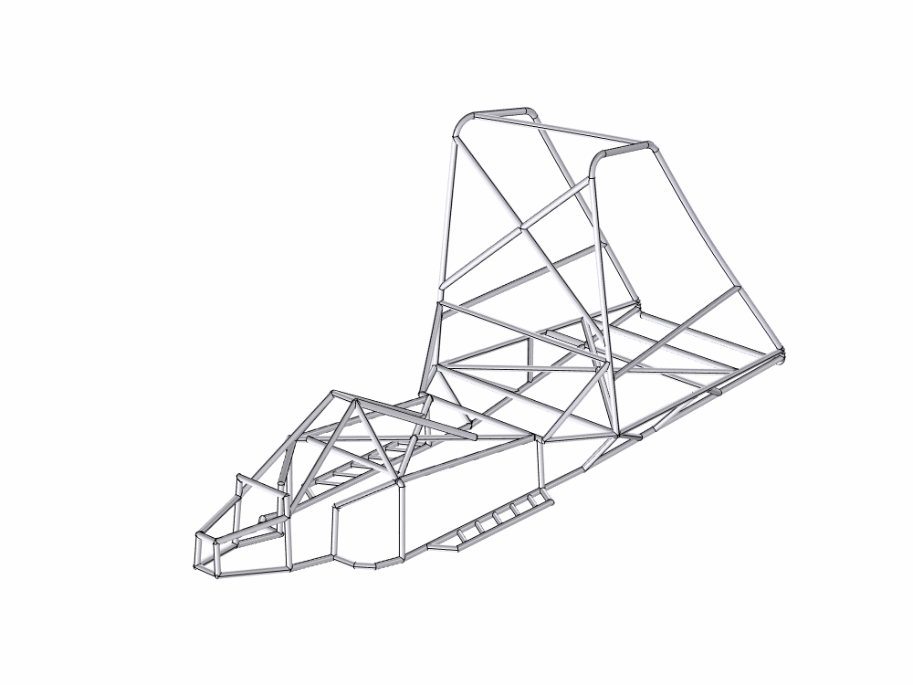

# Roll Cage Deformation Simulation in COMSOL

**Daniel Jones – Boston University – ME 700 Final Project**

This project builds on a previous roll cage design for a rescue snowmobile, with the goal of verifying its effectiveness in severe crash scenarios. Using COMSOL Multiphysics, I simulate various crash configurations to determine how the structure behaves under nonlinear deformation and identify potential failure modes like buckling. 

By enabling geometric nonlinearity, applying crash-equivalent loads, and refining the mesh both through element size and polynomial order (p- and h-refinement), the simulation offers insights into the structural limits of the design. Additionally, it highlights solver behavior near critical instability thresholds, providing guidance on model robustness and post-buckling limitations.

---

## Class Skills and Methods Demonstrated

While I had prior experience using COMSOL, this project showcases several new capabilities developed through this course:

- **Understanding and Applying Geometric Nonlinearity**: I learned how to interpret nonlinear structural behavior such as post-buckling deformation and configure solvers to handle stability loss in large deformation regimes.
- **Newton-Raphson Solver Mechanics**: I now understand how COMSOL's nonlinear solver operates internally—assembling the residual, linearizing the system, and performing iterative updates until convergence is reached.
- **p- and h-Refinement for Mesh Sensitivity**: I gained experience running structured studies to verify convergence behavior through both mesh density (h-refinement) and element order (p-refinement), something I had never implemented before.
- **Theory-Driven Modeling**: I was able to trace the implementation back to weak form derivations and understand the mathematical assumptions underlying stress-strain calculations, stiffness matrix assembly, and material linearity.
- **Interpreting Non-Convergence and Stability Loss**: This project taught me to recognize solver failure as a meaningful physical result, such as identifying the onset of post-buckling behavior.
- **Markdown Documentation for FEA Projects**: I developed a clear and technical documentation workflow in Markdown using GitHub, organizing a structured README with rendered equations, animations, and solver analysis.
  
These skills apply theory to simulation practice, bridging coursework with a realistic mechanical engineering challenge.

---

## Full Report PDF

For a complete breakdown of the modeling process, solver assumptions, mesh settings:

*The CAD files for running the simulation are included in this repository, but the COMSOL files are too large to include here.

[**View Full COMSOL Simulation Documentation (PDF)**](COMSOL%20Simulation%20Documentation.pdf)

---

## Simulation Result GIFs
**The following animations show crash deformation results under increasing impact speeds, ranging from 10 mph to 40 mph in 10 mph increments.**  
Each GIF corresponds to a different crash scenario, helping visualize how the structure responds under varying load directions and severities.

### Full Top-Down Roll Over
This simplified, symmetric loading case applies a vertical crash force to the top of the roll cage and serves as a baseline for comparing deformation behavior. While less realistic than other crash types, it reveals overall structural flexibility and initial buckling tendencies.
 

### Frontal Rollover Impact
This scenario simulates a forward-tipping crash, applying an angled force to the front portion of the roll cage. It better reflects real-world rollover events where forward momentum leads to impact on the front end of the structure.
 

### Side Rollover Impact
This animation shows deformation from a lateral rollover crash, where the snowmobile impacts the ground sideways. The simulation reveals significant deflection into the rear passenger head space, indicating a possible structural vulnerability.
 

### Updated Design with Rear Support Bracket
To address the lateral deformation observed in the previous case, this updated model includes an added rear support bracket. The resulting animation demonstrates reduced deflection into the passenger zone, validating the effectiveness of the design modification.
 

# Roll Cage COMSOL Simulation: Finite Element Method Behind the Interface

This document explains **how COMSOL Multiphysics internally models a solid mechanics simulation** like the roll cage deformation study described, using the finite element method (FEM).

---
## 1. Governing Equations

In linear elasticity (prior to plasticity or hyperelasticity), COMSOL solves:

$$
\nabla \cdot \boldsymbol{\sigma} + \mathbf{f} = \rho \ddot{\mathbf{u}}
$$

In the quasistatic case (stationary study with no inertial effects):

$$
\nabla \cdot \boldsymbol{\sigma} + \mathbf{f} = 0
$$

Where:
- $\boldsymbol{\sigma}$ is the Cauchy stress tensor
- $\mathbf{u}$ is the displacement vector field
- $\mathbf{f}$ is the body force
- $\rho$ is the density

### Constitutive Law (Linear Elastic Material)
COMSOL uses Hooke’s law for isotropic materials:

$$
\boldsymbol{\sigma} = \lambda (\nabla \cdot \mathbf{u}) \mathbf{I} + 2\mu \boldsymbol{\varepsilon}
$$

where $\lambda$ and $\mu$ are the Lamé parameters:

$$
\lambda = \frac{E\nu}{(1+\nu)(1-2\nu)}, \quad \mu = \frac{E}{2(1+\nu)}
$$

and the strain-displacement relation is:

$$
\boldsymbol{\varepsilon} = \frac{1}{2}(\nabla \mathbf{u} + \nabla \mathbf{u}^T)
$$

---

## 2. Weak Formulation

To apply FEM, COMSOL rewrites the strong form as a weak (variational) form.

This is achieved by multiplying by a test function $\mathbf{v}$ and integrating over the domain $\Omega$:

$$
\int_{\Omega} \boldsymbol{\sigma} : \nabla \mathbf{v} \, d\Omega = \int_{\Omega} \mathbf{f} \cdot \mathbf{v} \, d\Omega + \int_{\Gamma_t} \bar{\mathbf{t}} \cdot \mathbf{v} \, d\Gamma
$$

Boundary conditions:
- Essential (Dirichlet): $\mathbf{u} = \mathbf{u}_0$ on $\Gamma_u$

  *These are represented by the **Fixed Constraints** under Solid Mechanics > Boundaries

- Natural (Neumann): $\boldsymbol{\sigma} \cdot \mathbf{n} = \bar{\mathbf{t}}$ on $\Gamma_t$

  *These are represented by the **Boundary Load Constraints**, such as applying -F_Crash in the y or z directions.

---

## 3. Discretization with Shape Functions

Discretization was set under **Solid Mechanics > Discretization > Displacement Field** with the following options:
- Study 1: Linear
- Study 2: Quadratic Serendipity
- Study 3: Quadratic Lagrange
  
COMSOL interpolates displacement with nodal shape functions

Shape functions \( N_i(x) \) approximate displacement as:

$$
\mathbf{u}(x) \approx \sum_i N_i(x) \mathbf{u}_i
$$

- $N_i$ are the shape functions (e.g., linear or quadratic polynomials)
- $\mathbf{u}_i$ are the nodal displacements
  
The resulting weak form is assembled into a matrix system:

$$
\mathbf{K}\mathbf{U} = \mathbf{F}
$$

Where:
- $\mathbf{K}$ is the global stiffness matrix
- $\mathbf{F}$ is the global force vector
- $\mathbf{U}$ is the nodal displacement vector

---

## 4. Geometric Nonlinearity

In **Study Settings > Stationary**, the box for **Include geometric nonlinearity** was checked, which enables the **Total Lagrangian** formulation in COMSOL.

The strain tensor becomes:

$$
\boldsymbol{E} = \frac{1}{2}(\nabla \mathbf{u} + \nabla \mathbf{u}^T + \nabla \mathbf{u}^T \nabla \mathbf{u})
$$

This is critical for capturing buckling and large-displacement behavior, particularly in the rollover scenarios.

---

## 5. Mesh and Refinement

For **H-refinement**, the mesh was generated using **Free Tetrahedral** with the following settings:

- Normal size failed due to narrow faces
- Fine size also failed
- Final mesh used: **Finer** (selected under `Mesh 1 > Size`)

For **p-refinement**, element order was varied through the Discretization node as described in Section 3.

Mesh convergence ensures accuracy of strain energy, stress distribution, and failure modes like buckling.

---

## 6. Solvers

Each study used a **Stationary solver** configured as follows:
- **Linearity**: set to **Nonlinear** under **Study > Solver Configurations > Stationary Solver 1 > General**
- **Geometric Nonlinearity**: enabled in **Study Settings**

The governing system of equations:

$$
\mathbf{K(U)} \mathbf{U} = \mathbf{F}
$$

COMSOL uses Newton-Raphson iterations:

$$
\mathbf{K}^{(k)} \Delta \mathbf{U}^{(k)} = -\mathbf{R}^{(k)}, \quad \mathbf{U}^{(k+1)} = \mathbf{U}^{(k)} + \Delta \mathbf{U}^{(k)}
$$

At each iteration \( k \), the solver performs the following steps:
1. Compute residual $\mathbf{R(U)} = \mathbf{K(U)} \mathbf{U} - \mathbf{F}$
2. Linearize and solve: $\mathbf{K}_T \Delta \mathbf{U} = -\mathbf{R}$
3. Update: $\mathbf{U}^{(k+1)} = \mathbf{U}^{(k)} + \Delta \mathbf{U}$

This repeats until the residual is below a tolerance.

---

## 7. Crash Load Application

Crash force was defined using:

$$
F_{\text{Crash}} = \frac{m \Delta v}{\Delta t}
$$

- delta_v was defined as a parameter swept from 10 to 40 mph
- m = 700 lb
- delta t = 0.05 s (assumed impact time)

This is applied as a **boundary force** on selected surfaces. COMSOL distributes the force over the selected boundary elements.

---

## 8. Buckling and Collapse

Because large displacements and geometric stiffness changes are included:

- COMSOL captures **elastic instability** (buckling)
- No post-buckling plasticity is modeled because an elastic material model is used

Non-convergence at crash speeds higher than delta_v = 45 mph suggests that the simulation has reached the critical buckling load. Beyond this limit, the structure enters the post-buckling regime, where the solver's underlying assumptions no longer hold.

---

## Summary

This simulation uses:
- Linear elastic material
- Geometric nonlinearity (nonlinear strain)
- Stationary solver with nonlinear iterations
- Boundary loads derived from crash impact
- Finite element mesh with tetrahedral elements
- Weak form of the elasticity equations

COMSOL automates many FEM tasks but is fundamentally solving the governing PDE in weak form using numerical discretization and Newton-Raphson methods.

